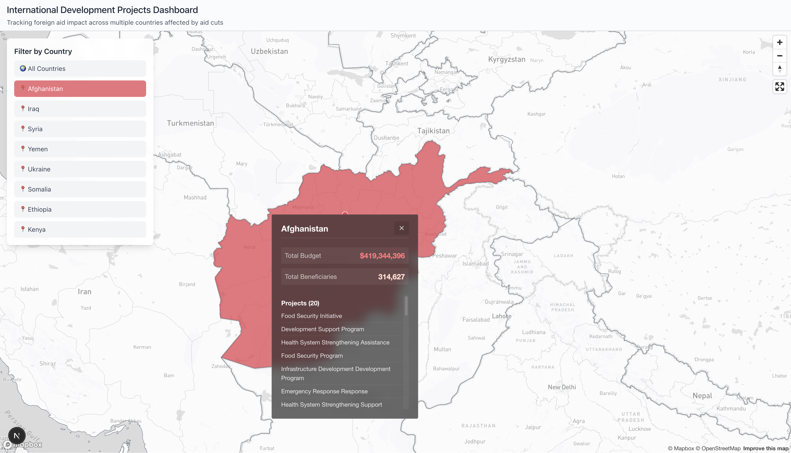

# International Development Projects Dashboard 🌍

An interactive map visualization showing the impact of international development projects and foreign aid across multiple countries. This dashboard helps track funding cuts, project status, and beneficiary impacts in regions affected by policy changes.



## ✨ Features

### 🗺️ Interactive Global Map

- **World View**: Start with a global perspective of all development projects
- **Country Focus**: Click any country or use the filter panel to zoom into specific regions
- **Project Visualization**: Each dot represents a development project with detailed information

### 📊 Comprehensive Data Tracking

- **Multi-Country Support**: Track projects across 8+ countries including Afghanistan, Iraq, Syria, Yemen, Ukraine, Somalia, Ethiopia, and Kenya
- **Budget & Beneficiaries**: Real-time tracking of project budgets and affected populations
- **Sector Analysis**: Projects categorized by development sectors (Health, Education, Infrastructure, etc.)
- **Status Monitoring**: Track project status (Active, Paused, Cancelled, Completed)

### 🎯 Advanced Filtering & Navigation

- **Country Filter Panel**: Easy selection of specific countries or global view
- **Interactive Popups**: Detailed project information with glassmorphism styling
- **Smooth Animations**: Seamless transitions between countries and zoom levels
- **Responsive Design**: Works across desktop, tablet, and mobile devices

### 📈 Impact Visualization

- **Budget Tracking**: Visual representation of funding amounts across regions
- **Beneficiary Counts**: Track how many people are affected by each project
- **Implementing Partners**: See which organizations are delivering aid
- **Geographic Distribution**: Understand where aid is concentrated

## 🚀 Getting Started

### Prerequisites

- Node.js 18+
- npm or yarn
- Mapbox API token

### Installation

1. **Clone the repository**

   ```bash
   git clone <repository-url>
   cd international-development-dashboard
   ```

2. **Install dependencies**

   ```bash
   npm install
   ```

3. **Set up environment variables**

   ```bash
   cp .env.example .env.local
   ```

   Add your Mapbox token to `.env.local`:

   ```env
   NEXT_PUBLIC_MAPBOX_ACCESS_TOKEN=pk.your_token_here
   ```

4. **Generate sample data**

   ```bash
   npm run generate-data
   ```

5. **Start the development server**

   ```bash
   npm run dev
   ```

6. **Open your browser**
   Navigate to [http://localhost:3000](http://localhost:3000)

## 📁 Project Structure

```
├── src/
│   ├── components/
│   │   └── MapboxMap.tsx          # Main map component
│   ├── lib/
│   │   └── config.ts              # Configuration & constants
│   ├── app/
│   │   ├── page.tsx               # Main dashboard page
│   │   ├── layout.tsx             # App layout
│   │   └── globals.css            # Global styles
├── scripts/
│   └── generate-data.js           # Data generation script
├── public/
│   └── data.geojson              # Project data (generated)
└── README.md
```

## 🛠️ Technology Stack

### Frontend

- **Next.js 15** - React framework with app router
- **TypeScript** - Type-safe development
- **Tailwind CSS** - Utility-first styling
- **Mapbox GL JS** - Interactive maps

### Data & APIs

- **GeoJSON** - Geographic data format
- **IATI Standard** - International aid transparency
- **REST APIs** - USAID, World Bank, UN data sources

### Development

- **ESLint** - Code quality
- **Hot Reload** - Fast development
- **Responsive Design** - Mobile-first approach

## 📊 Data Sources & Integration

### Current Data Sources

- **Generated Sample Data**: Realistic development project data across 8 countries
- **GeoBoundaries**: Administrative boundary data for accurate mapping
- **World Bank Open Data**: Country-level statistics and indicators

### Future API Integrations

- **IATI Datastore**: International Aid Transparency Initiative data
- **USAID Development Data Library**: Official US development assistance data
- **ForeignAssistance.gov**: Comprehensive US foreign aid tracking
- **UN OCHA**: Humanitarian data and crisis information

## 🌍 Supported Countries

Currently tracking development projects in:

| Country        | Projects | Focus Areas                        | Status             |
| -------------- | -------- | ---------------------------------- | ------------------ |
| 🇦🇫 Afghanistan | 20+      | Agriculture, Health, Education     | Emergency Response |
| 🇮🇶 Iraq        | 20+      | Infrastructure, Governance         | Reconstruction     |
| 🇸🇾 Syria       | 15+      | Humanitarian Aid, Health           | Crisis Response    |
| 🇾🇪 Yemen       | 9+       | Food Security, Water               | Emergency Aid      |
| 🇺🇦 Ukraine     | 16+      | Emergency Response, Infrastructure | Conflict Support   |
| 🇸🇴 Somalia     | 15+      | Food Security, Health              | Humanitarian       |
| 🇪🇹 Ethiopia    | 10+      | Agriculture, Education             | Development        |
| 🇰🇪 Kenya       | 13+      | Economic Growth, Health            | Development        |

## 🎨 UI/UX Features

### Interactive Elements

- **Country Filter Panel**: Intuitive country selection with visual feedback
- **Smart Popups**: Context-aware information displays with consistent styling
- **Smooth Transitions**: Animated map movements and zoom controls
- **Loading States**: Clear progress indicators for data loading

### Design System

- **Glassmorphism**: Modern translucent card designs
- **Consistent Colors**: Status-based color coding for projects
- **Typography**: Clean, readable fonts optimized for data display
- **Responsive Layout**: Adaptive design for all screen sizes

### Accessibility

- **Keyboard Navigation**: Full keyboard support for all interactions
- **Screen Reader Support**: Semantic HTML and ARIA labels
- **High Contrast**: Accessible color combinations
- **Focus Indicators**: Clear visual focus states

## 🔧 Configuration & Customization

### Adding New Countries

1. Update `COUNTRIES` configuration in `scripts/generate-data.js`
2. Add country-specific data sources
3. Configure map bounds and zoom levels
4. Update styling and color schemes

### Data Integration

1. **API Configuration**: Update `src/lib/config.ts` with new data sources
2. **Data Processing**: Modify data transformation logic in `MapboxMap.tsx`
3. **Schema Updates**: Extend TypeScript interfaces for new data fields

### Styling Customization

1. **Colors**: Update color schemes in `src/lib/config.ts`
2. **Layouts**: Modify component styles in `src/app/globals.css`
3. **Animations**: Adjust transition timings and effects

## 📈 Performance & Scalability

### Optimization Features

- **Efficient Data Loading**: Parallel fetching of map and project data
- **Smart Rendering**: Optimized Mapbox layer management
- **Memory Management**: Proper cleanup of map resources
- **Bundle Optimization**: Tree shaking and code splitting

### Scalability Considerations

- **Modular Architecture**: Extensible component structure
- **Type Safety**: Full TypeScript coverage for maintainability
- **Configuration Management**: Centralized settings for easy updates
- **Error Handling**: Comprehensive error boundaries and fallbacks

## 🤝 Contributing

### Development Workflow

1. **Fork the repository**
2. **Create a feature branch**: `git checkout -b feature/amazing-feature`
3. **Make your changes** with proper TypeScript types
4. **Test thoroughly** across different countries and zoom levels
5. **Submit a pull request** with detailed description

### Code Quality

- Follow TypeScript best practices
- Use semantic commit messages
- Test on multiple devices and browsers
- Ensure accessibility compliance

## 📄 License

This project is open source and available under the [MIT License](LICENSE).

## 🙏 Acknowledgments & Data Sources

### Data Providers

- **International Aid Transparency Initiative (IATI)** - Development project standards
- **USAID Development Data Library** - US development assistance data
- **World Bank Open Data** - Global development indicators
- **GeoBoundaries** - Administrative boundary data
- **UN OCHA** - Humanitarian crisis information

### Inspiration

- **The Impact Project** by Abby André - Tracking federal funding impacts
- **USAID Transparency Dashboard** - Government aid transparency
- **Development Finance Data Portal** - Multi-donor tracking systems

### Technology Credits

- **Mapbox** - Interactive mapping platform
- **Next.js** - React framework
- **Tailwind CSS** - Utility-first CSS framework
- **TypeScript** - Type-safe JavaScript

---

**🌍 Making foreign aid impacts visible, one map at a time.**

For questions, suggestions, or collaboration opportunities, please [open an issue](https://github.com/your-repo/issues) or contact the development team.
